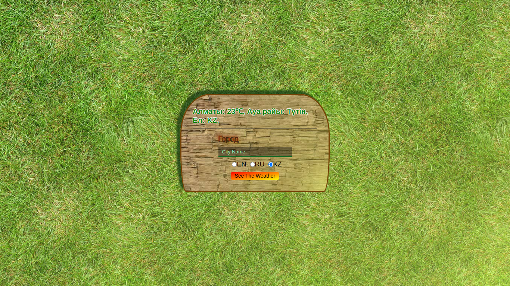

# Simple Weather App 🌦️

This is a basic weather app built using Express.js for the backend and plain JavaScript for the frontend. It allows users to get the current weather for a specific location.

## Features

- Get the current weather for a location.
- Minimalistic and straightforward interface.
- Powered by the OpenWeatherMap API.

## Setup

1. Clone this repository to your local machine.
1. Navigate to the project directory.
1. Install the necessary dependencies. `npm i`
1. Add your OpenWeatherMap API key into `./requests/weather.request.js`.

## Usage
To run the app, use the following command: `npm start`
Visit `http://localhost:3000` in your web browser to access the weather app.

  

## Important Note
This is a simple project created for study purposes and can be used in any way you like. Feel free to modify and extend it as needed for your learning and development journey.
